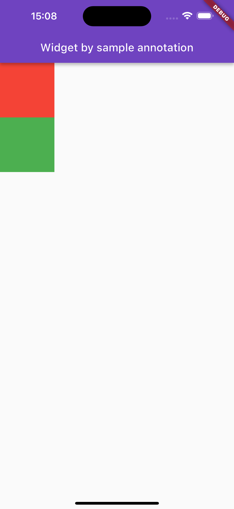

# Reflectable

### Reference

[https://marketsplash.com/tutorials/dart/dart-metadata/](https://marketsplash.com/tutorials/dart/dart-metadata/)

[https://itnext.io/understanding-reflection-and-annotations-in-dart-f1e28efdb064#:~:text=To reflect on types and,passed in as the argument](https://itnext.io/understanding-reflection-and-annotations-in-dart-f1e28efdb064#:~:text=To%20reflect%20on%20types%20and,passed%20in%20as%20the%20argument)

### Metadata

[https://dart.dev/language/metadata](https://dart.dev/language/metadata)

[https://api.flutter.dev/flutter/meta/meta-library.html](https://api.flutter.dev/flutter/meta/meta-library.html)

dart: Mirror -  **Status: Unstable**

[https://api.dart.dev/stable/3.1.3/dart-mirrors/dart-mirrors-library.html](https://api.dart.dev/stable/3.1.3/dart-mirrors/dart-mirrors-library.html)

### Use Cases For Metadata

Metadata finds its application in various scenarios:

- **Code Documentation**: By annotating code with metadata, developers can provide richer context, aiding in code understanding and documentation generation.
- **Tooling and Libraries**: Tools and libraries can leverage metadata to automate tasks, provide warnings, or offer suggestions.
- **Code Generation**: Metadata can be used to generate boilerplate code, reducing manual effort and potential errors.

### Description

Listing all the widgets in a Flutter project is like a document that helps developers quickly identify existing widgets within the current project. This can aid in reusing widgets, reducing development time.

### Dependencies:

in pubspec.yaml

```yaml
dependencies: 

//https://pub.dev/packages/reflectable

reflectable: ^4.0.5

dev_dependencies: 

//support generate code

//https://pub.dev/packages/build_runner

 build_runner: ^2.4.6
```

### Config:

Create annotation type:

```dart
import 'package:reflectable/reflectable.dart';

class SampleWidget extends Reflectable {
  const SampleWidget() : super(invokingCapability, typingCapability, reflectedTypeCapability);
}

const sampleWidget = SampleWidget();
```

### Create widget is marked by SampeWidget annotation

```dart
import 'package:flutter/material.dart';
import 'package:flutter_reflectable/sample_annotation.dart';

class GreenBoxWidget extends StatelessWidget {
  const GreenBoxWidget({Key? key, this.width, this.height}) : super(key: key);

  final double? width;
  final double? height;

  @override
  Widget build(BuildContext context) {
    return Container(
      color: Colors.green,
      width: width,
      height: height,
    );
  }
}

@sampleWidget
class SampleGreenBoxWidget extends StatelessWidget {
  const SampleGreenBoxWidget({super.key});

  @override
  Widget build(BuildContext context) {
    return const GreenBoxWidget(
      height: 100,
      width: 100,
    );
  }
}
```

### Config to generate

In main.dart

```dart
///*important
///need import 'package:flutter_reflectable/widgets/widget.dart';
import 'package:flutter_reflectable/widgets/widget.dart';

import 'main.reflectable.dart'; 
```

main.reflectable.dart: this file will be generated

In widgets/widget.dart

```jsx
///*important
///need import this file to able generate code

export 'red_box_widget.dart';
export 'green_box_widget.dart';
```

We need to import this file to generate can detect what annotation need to generate

### Run script:

```
dart run build_runner build
```

### Config show UI

```dart
void main() {
	//this [initializeReflectable] required to call reflectable
  initializeReflectable();

  runApp(const MyApp());
}
```

```dart
class SampleListWidget extends StatelessWidget {
  const SampleListWidget({Key? key}) : super(key: key);

  @override
  Widget build(BuildContext context) {
    return Scaffold(
      appBar: AppBar(title: Text('Widget by sample annotation')),
      body: Column(
        children: sampleWidget.annotatedClasses.map((e) => e.newInstance('', []) as Widget).toList(),
      ),
    );
  }
}
```

```dart
//main value of this article
sampleWidget.annotatedClasses.map((e) => e.newInstance('', []) as Widget).toList(),
```

> sampleWidget.annotatedClasses:  get all Type were marked with @sampleWidget 

e.newInstance('', []) : get an instance of each type by call default constructor (it have no param arguments)
> 

### The result



# Apply with StoryBook

### Introduce about story book and import it

[https://pub.dev/packages/storybook_flutter](https://pub.dev/packages/storybook_flutter)

### Define Story book name

```dart
const String defaultName = 'unknown'; 

mixin StoryBookName on Widget {
  String get name;
}
```

> Need to define StoryBookName because in current time can not pass value to Annotation type
> 

```dart
///This code not work for generate code
///This is current limit in Reflectable of Dart
class SampleWidget extends Reflectable {
  const SampleWidget(this.name) : super(invokingCapability, typingCapability, reflectedTypeCapability);
  
  final String name;
}
```

### Add mixin for SampeWidget

```dart
@sampleWidget
class SampleGreenBoxWidget extends StatelessWidget with StoryBookName {
  const SampleGreenBoxWidget({super.key});

  @override
  Widget build(BuildContext context) {
    return const GreenBoxWidget(
      height: 100,
      width: 100,
    );
  }

  @override
  String get name => 'box/green-box';
}
```

### Widget without mixin

```dart
class DefaultNameBox extends StatelessWidget {
  const DefaultNameBox({Key? key, this.width, this.height}) : super(key: key);

  final double? width;
  final double? height;

  @override
  Widget build(BuildContext context) {
    return Container(
      color: Colors.grey,
      width: width,
      height: height,
      child: const Text(defaultName),
    );
  }
}

@sampleWidget
class SampleDefaultNameBoxWidget extends StatelessWidget {
  const SampleDefaultNameBoxWidget({super.key});

  @override
  Widget build(BuildContext context) {
    return const DefaultNameBox(
      height: 100,
      width: 100,
    );
  }
}
```

<aside>
💡 remember add export to widget.dart
`export 'default_name_box_widget.dart';`

</aside>

### Set up story book widget

```dart
class ReflectableStoryBookWidget extends StatelessWidget {
  const ReflectableStoryBookWidget({Key? key}) : super(key: key);

  @override
  Widget build(BuildContext context) {
    return Storybook(
      plugins: initializePlugins(
        initialDeviceFrameData: (
          isFrameVisible: true,
          device: Devices.ios.iPad,
          orientation: Orientation.portrait,
        ),
      ),
      stories: sampleWidget.annotatedClasses
          .where((classMirror) => !classMirror.isAbstract)
          .map((e) => e.newInstance('', []))
          .whereType<Widget>()
          .map((e) => Story(name: e is StoryBookName ? e.name : defaultName, builder: (_) => e))
          .toList(),
    );
  }
}
```

<aside>
💡 remember re run generate script

</aside>

### The result


# Conclusion

Git: https://github.com/1712916/flutter-reflectable
